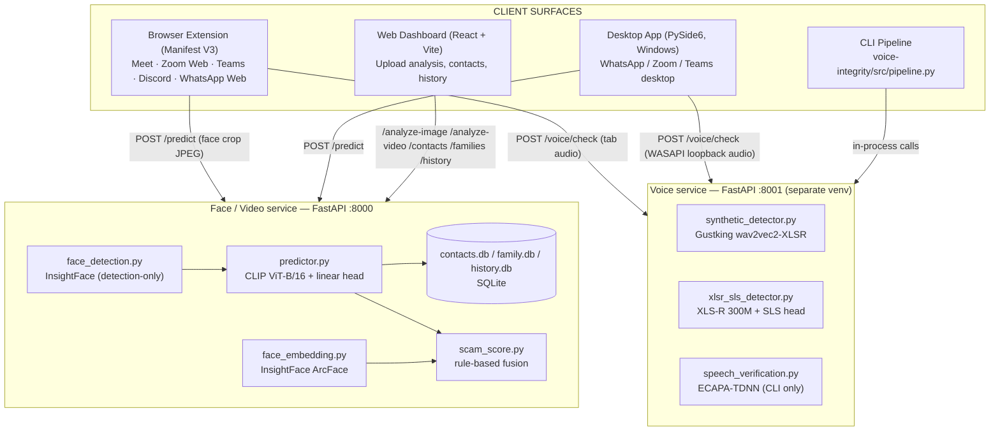
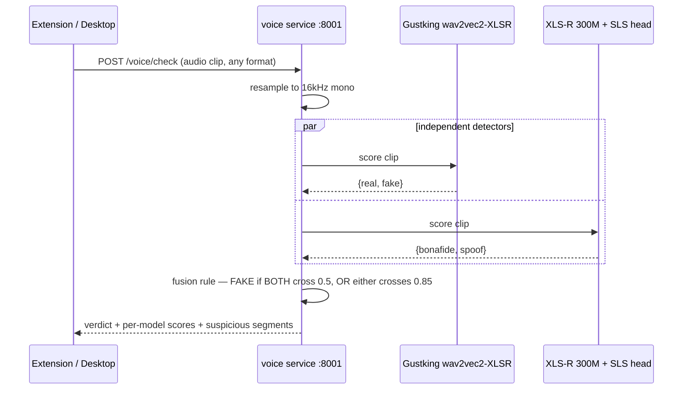

# Trinetra

**Real-time deepfake and voice-clone defense for video calls.**

Trinetra watches faces and voices during a live call — Google Meet, Zoom, Microsoft Teams,
Discord, or WhatsApp — and flags likely deepfakes or cloned voices *while the call is still
happening*, while also cross-checking the caller's identity against your contacts or family
circle. Everything runs locally: two FastAPI services on `127.0.0.1` do the inference, and no
call media is ever sent to a third-party cloud API.

> This README is the entry point. For the full technical write-up (model internals, calibration
> history, dataset provenance, and every documented limitation) see
> [`TRINETRA_REPORT.md`](./TRINETRA_REPORT.md).

---

## Table of contents

1. [What it does](#1-what-it-does)
2. [Architecture](#2-architecture)
3. [Detection pipeline, step by step](#3-detection-pipeline-step-by-step)
4. [Models in the loop](#4-models-in-the-loop)
5. [Tech stack](#5-tech-stack)
6. [Project structure](#6-project-structure)
7. [Getting started](#7-getting-started)
8. [API reference](#8-api-reference)
9. [Configuration](#9-configuration)
10. [Known limitations](#10-known-limitations)
11. [Testing](#11-testing)
12. [Datasets & model credits](#12-datasets--model-credits)

---

## 1. What it does

| Client | Purpose | Reaches calls on |
|---|---|---|
| **Browser extension** (Manifest V3) | Live in-page detection overlay | Google Meet, Zoom Web, Microsoft Teams, Discord, WhatsApp Web |
| **Desktop app** (PySide6, Windows) | Live detection for apps a browser extension can't reach | WhatsApp Desktop, Zoom desktop, Teams desktop |
| **Web dashboard** (React) | Offline/forensic analysis of an uploaded photo or video, contact & history management | Any browser, `localhost` |
| **CLI pipeline** (`voice-integrity/src/pipeline.py`) | One-shot reference-vs-incoming voice check | Manual/analyst use |

All four talk to two backend services that run entirely on the user's own machine:

- Detects likely-fake faces per video tile, live, with a `REAL / FAKE / UNCERTAIN` badge.
- Detects voice cloning/spoofing in call audio, independent of the face check.
- Matches a caller's face against enrolled **contacts** or a **family circle**, and raises an
  explainable **scam-likelihood score** when a face is both deepfake-flagged and doesn't match
  who it claims to be.
- Offers offline analysis of an uploaded photo (every face scored) or video (sampled frames,
  suspicious-segment timeline), exportable as a PDF report.
- Keeps a queryable history of past predictions.

---

## 2. Architecture

### 2.1 Component map



### 2.2 Why two separate backend processes

The face stack (`torch`, `open_clip`, `insightface`, `onnxruntime`) and the voice stack
(`fairseq`, `speechbrain`, hand-patched `hydra-core`/`omegaconf`) have real, unresolved
dependency conflicts — so they run as two independent FastAPI services in two independent
virtualenvs instead of fighting the conflict:

- `backend/` → `uvicorn main:app` on **:8000**
- `voice-integrity/src/` → `uvicorn server:app` on **:8001**

Every client calls both services independently and combines the results client-side — there is
no server-side fusion of face and voice signals.

---

## 3. Detection pipeline, step by step

### 3.1 Real-time face pipeline (browser extension)

```mermaid
sequenceDiagram
    participant V as <video> tile
    participant CS as content.js (every 3s)
    participant OFF as offscreen.js (MediaPipe WASM)
    participant BG as background.js (service worker)
    participant BE as backend :8000

    CS->>CS: captureFrame(video) -> canvas
    CS->>BG: DETECT_FACES (frame as data URL)
    BG->>OFF: OFFSCREEN_DETECT_FACES
    OFF-->>BG: faces[] (normalized bbox, BlazeFace)
    BG-->>CS: faces[]
    CS->>CS: cropFaceFromCanvas() per face -> 256x256 JPEG
    par per detected face
        CS->>BE: POST /predict (face.jpg, platform, contact_id?)
        BE-->>CS: fake_probability, classification, identity_match, scam_likelihood
    end
    CS->>CS: overlay.js draws REAL/FAKE/UNCERTAIN badge per face
```

Audio runs on a parallel, independent loop: `content.js` fires a one-time `MEETING_STARTED`
signal on the first detected video tile → `background.js` starts `chrome.tabCapture` → the
captured tab audio is analyzed in the offscreen document → results come back as
`VOICE_CHECK_RESULT` messages and render as a page-level voice banner, independent of the
per-tile face badges.

### 3.2 Voice anti-spoofing pipeline



The two detectors share no architecture on purpose — independent opinions are more useful than
one model's confidence. The `HIGH_CONFIDENCE_SPOOF=0.85` override exists because it was
calibrated against a real clone sample where XLS-R+SLS scored 99.9% spoof but Gustking only
reached 44% — the plain "both must agree" rule alone would have missed it.

### 3.3 Desktop pipeline

Same shape, different capture source: the **Windows Graphics Capture API** (`windows-capture`)
grabs frames from a user-picked window instead of reading a DOM `<video>` element. MediaPipe runs
natively (no offscreen-document workaround needed), `tracker.py` tracks faces across frames,
`overlay.py` draws a transparent always-on-top window over the captured app, and
`audio_worker.py` captures **system-wide** output audio via WASAPI loopback
(`pyaudiowpatch`) — a documented limitation: it's not per-application audio.

### 3.4 Dashboard / offline analysis pipeline

The dashboard does **not** reuse the real-time per-crop contract — it uploads a raw, uncropped
photo or video, and the backend does its own face detection server-side, crops with a margin,
quality-gates, and batches every crop through one model forward pass:

- **Image**: worst-case-wins across all faces (one confidently-fake face is the finding).
- **Video**: samples ~1 frame/sec (clamped 5–40 frames), scores the largest face per frame,
  aggregates by **median** (outlier-resistant), and reports **suspicious segments** — runs of
  ≥2 consecutive flagged frames, so a single motion-blur spike can't trigger a false positive.

### 3.5 Identity verification & scam score

- **Contacts**: one reference photo → one 512-d ArcFace embedding, stored in `contacts.db`.
- **Family circles**: multiple enrollment photos averaged into one reference embedding;
  membership goes through a passcode-gated `pending → approved/rejected` workflow.
- **Matching**: cosine similarity vs. the stored embedding, threshold `0.45`.
- **Scam score** (`scam_score.py`): a transparent, rule-based fusion —
  `0.35 × face_fake_probability + 0.25 × identity_mismatch`, renormalized to `[0, 1]` — not a
  trained model, since no labeled multimodal scam-call dataset exists to train one on. Voice
  signals were deliberately excluded after the voice ensemble scored known fakes as only 2–7%
  fake in validation — a confidently-wrong signal was judged worse than no signal here.

---

## 4. Models in the loop

| Model | Component | Role | Reported accuracy |
|---|---|---|---|
| **OpenCLIP ViT-B/16** (frozen, `laion2b_s34b_b88k`) + trained linear head | `backend/predictor.py` | Face deepfake classifier | 0.95 train / **0.54–0.58 held-out** video accuracy — see [§10](#10-known-limitations) |
| **InsightFace `buffalo_l`** — RetinaFace `det_10g` | `backend/face_detection.py` | Server-side face detection (dashboard uploads) | Pretrained, not evaluated locally |
| **MediaPipe BlazeFace** (short-range) | extension (WASM) / desktop (native) | Client-side real-time face detection | Pretrained |
| **InsightFace `buffalo_l`** — ArcFace | `backend/face_embedding.py` | 512-d identity embeddings for contacts/family | Pretrained |
| **Gustking wav2vec2-XLSR** | `voice-integrity/src/synthetic_detector.py` | Voice anti-spoofing detector A | ~93% in-domain (model card) |
| **XLS-R 300M + SLS head** | `voice-integrity/src/xlsr_sls_detector.py` | Voice anti-spoofing detector B | 2.14% EER (ASVspoof21 DF) · 3.51% EER (LA) · 7.84% EER (In-the-Wild) |
| **ECAPA-TDNN** (`speechbrain/spkrec-ecapa-voxceleb`) | `voice-integrity/src/speech_verification.py` | Speaker-identity verification | CLI pipeline only, not wired into the automatic path |

---

## 5. Tech stack

| Layer | Technology |
|---|---|
| **Browser extension** | Manifest V3, vanilla JS content scripts, MediaPipe Tasks Vision (BlazeFace, WASM) in an offscreen document, `chrome.tabCapture` |
| **Desktop app** | Python, PySide6 (Qt), `windows-capture` (Windows Graphics Capture API), `pywin32`, MediaPipe, `pyaudiowpatch` (WASAPI loopback) |
| **Web dashboard** | React 19 + TypeScript, Vite 8, Tailwind CSS 4, `react-router-dom` 7, `jspdf` / `jspdf-autotable` |
| **Face/video backend** | FastAPI, `torch` + `open_clip_torch` (CLIP ViT-B/16), `insightface`, `onnxruntime`, `opencv-python`, SQLite |
| **Voice backend** | FastAPI, `torch` + `torchaudio`, `transformers`, `fairseq` 0.12.2, `speechbrain`, `noisereduce` |
| **Storage** | SQLite (`contacts.db`, `family.db`, `history.db`) — local files, no external DB server |

---

## 6. Project structure

```
meet-deepfake-detector/
├── backend/                # FastAPI face/video service — :8000
│   ├── main.py              # routes and app wiring
│   ├── predictor.py         # CLIP + linear head deepfake classifier
│   ├── clip_backbone.py     # frozen CLIP ViT-B/16 encoder
│   ├── face_detection.py    # InsightFace detection-only
│   ├── face_embedding.py    # InsightFace ArcFace embeddings
│   ├── image_pipeline.py    # offline photo analysis
│   ├── video_pipeline.py    # offline video analysis (sampling + aggregation)
│   ├── scam_score.py        # rule-based scam-likelihood fusion
│   ├── contacts_db.py / family_db.py / history_db.py   # SQLite storage
│   ├── config.py            # centralized, env-overridable config
│   ├── models/               # demo_head.pt checkpoint + eval report
│   ├── scripts/               # dev tools (benchmarking, calibration)
│   └── tests/                  # pytest suite
│
├── voice-integrity/        # FastAPI voice anti-spoofing service — :8001 (own venv)
│   └── src/
│       ├── server.py         # routes: /voice/enroll, /voice/check, ...
│       ├── synthetic_detector.py   # Gustking wav2vec2-XLSR detector
│       ├── xlsr_sls_detector.py    # XLS-R 300M + SLS head detector
│       ├── speech_verification.py  # ECAPA-TDNN speaker ID (CLI only)
│       ├── audio_enhance.py        # optional denoise/enhance preprocessing
│       ├── pipeline.py             # CLI 3-check flow
│       └── audio_utils.py
│
├── desktop/                 # PySide6 native-app client (Windows)
│   ├── main.py               # app entry point
│   ├── face_pipeline.py      # MediaPipe detection + tracking
│   ├── audio_worker.py       # WASAPI loopback capture + voice check
│   ├── api_client.py         # calls backend :8000 and voice :8001
│   ├── overlay.py            # transparent always-on-top result overlay
│   └── window_picker.py      # target-window selection (pywin32)
│
├── extension/                # Manifest V3 browser extension
│   ├── manifest.json
│   ├── content.js             # per-tile capture loop (3s interval)
│   ├── offscreen.js           # MediaPipe WASM detection + voice analysis
│   ├── background.js          # service worker, tabCapture
│   └── overlay.js             # REAL/FAKE/UNCERTAIN badge rendering
│
├── frontend/                  # React + Vite dashboard
│   └── src/
│       ├── pages/analyze/       # image/video upload analysis
│       ├── pages/reports/       # PDF report generation
│       ├── pages/history/       # prediction history
│       └── lib/                  # API clients (api.ts, voiceCheck.ts)
│
├── TRINETRA_REPORT.md         # full architecture & technical design report
└── README.md                  # this file
```

---

## 7. Getting started

### Prerequisites

| Requirement | Why |
|---|---|
| Python 3.11 | Both backend services; **two separate virtualenvs required** — `backend/venv` and `voice-integrity/venv` — their dependencies genuinely conflict |
| Node.js + npm | Dashboard (Vite 8) |
| Windows | Desktop client only (Windows Graphics Capture API, WASAPI loopback) — backend, voice service, extension, and dashboard are OS-agnostic |
| Chrome / Chromium | Browser extension (Manifest V3, `offscreen`, `tabCapture`) |
| GPU (optional) | Both `torch` models fall back to CPU automatically; a CUDA GPU accelerates them |

First run downloads model weights: CLIP ViT-B/16 (~600MB), InsightFace `buffalo_l` (~350MB),
Gustking wav2vec2 checkpoint, XLS-R 300M + SLS head, ECAPA-TDNN (~20MB) — all cached locally
after.

### 1. Face/video backend — `:8000`

```bash
cd backend
python -m venv venv
venv\Scripts\activate          # Windows
pip install -r requirements.txt

# For GPU inference, install the matching torch build first:
# pip install torch==2.13.0 --index-url https://download.pytorch.org/whl/cu130

uvicorn main:app --reload
```

### 2. Voice anti-spoofing service — `:8001`

Must run from its own venv, and from inside `src/` (it imports sibling modules with bare
`import audio_utils`, which only resolves with `src/` itself on `sys.path`):

```bash
cd voice-integrity
python -m venv venv
venv\Scripts\activate
pip install -r requirements.txt

cd src
..\venv\Scripts\python.exe -m uvicorn server:app --port 8001
```

### 3. Browser extension

Load `extension/` as an unpacked extension: `chrome://extensions` → enable **Developer mode** →
**Load unpacked** → select the `extension/` folder. Requires both backend services running.

### 4. Desktop app

```bash
cd desktop
python -m venv venv
venv\Scripts\activate
pip install -r requirements.txt
python main.py
```

### 5. Web dashboard

```bash
cd frontend
npm install
npm run dev
```

Runs at `http://localhost:5173`; talks to `:8000` and `:8001` per `.env.example`.

---

## 8. API reference

### Face/video service — `:8000`

| Endpoint | Purpose |
|---|---|
| `POST /predict` | Score one pre-cropped face; optional identity match + scam score |
| `POST /analyze-image` | Detect + score every face in an uploaded photo |
| `POST /analyze-video` | Sample + score frames from an uploaded video |
| `POST /contacts`, `GET /contacts` | Enroll / list trusted contacts |
| `POST /families`, `.../join`, `.../members`, `.../approve`, `.../reject` | Family Circle workflow |
| `GET /history` | Recent predictions log |
| `GET /health` | Liveness check |
| `GET /model-info` | Which checkpoint/device is actually loaded |
| `GET /dashboard`, `/analyze-ui`, `/contacts-ui`, `/family-ui` | Built-in HTML UIs |

### Voice service — `:8001`

| Endpoint | Purpose |
|---|---|
| `POST /voice/enroll` | Save a reference voice sample under a name (multipart: `name`, `file`) |
| `GET /voice/enrolled` | List enrolled names |
| `GET /voice/enrolled/{name}/audio` | Stream back an enrolled sample |
| `DELETE /voice/enrolled/{name}` | Remove an enrollment |
| `POST /voice/check` | Anti-spoofing verdict on an uploaded clip; optional `enhance`, optional `reference_name` for speaker-identity check |
| `GET /health` | Liveness check |

`/voice/check` response includes per-model scores (`gustking`, `xlsr_sls`), an overall `verdict`
(`FAKE/SPOOFED` / `LIKELY GENUINE`), per-segment scores localizing *where* in the clip the
spoofing signal is strongest, and optional `identity`/`enhancement` blocks.

---

## 9. Configuration

| Component | How it's configured |
|---|---|
| `backend/config.py` | Centralizes upload limits, quality thresholds, classification thresholds (`FAKE_THRESHOLD=0.65`, `REAL_THRESHOLD=0.35`), video sampling — all environment-variable overridable |
| `frontend/.env.example` | `VITE_API_BASE_URL` (default `http://127.0.0.1:8000`), `VITE_VOICE_API_BASE_URL` (default `http://127.0.0.1:8001`) |
| `voice-integrity/src/server.py` | `SPOOF_THRESHOLD=0.5`, `HIGH_CONFIDENCE_SPOOF=0.85` fusion thresholds |
| CORS | Restricted to the exact set of supported call-platform origins plus localhost dev ports — not open to arbitrary origins |

---

## 10. Known limitations

This codebase documents its own limitations directly in code comments rather than hiding them:

- **The demo face classifier is small and overfit** — trained on 80 videos; held-out video
  accuracy is 0.54–0.58 (barely above chance) vs. 0.95 on training data. Treat
  `fake_probability` as a weak signal, not a verdict, until retrained on more data.
- **Classification thresholds (0.65/0.35) are not a calibrated operating point** — set from
  informal manual testing against ~120 labeled frames, not a full precision/recall sweep.
- **The scam-likelihood score is heuristic, not learned**, by design — no labeled multimodal
  scam-call dataset exists to train a fusion model on.
- **XLS-R+SLS generalizes worst on real-world audio** (7.84% EER on In-the-Wild vs. 2–3.5% on
  in-domain ASVspoof splits) — mitigated, not solved, by the dual-model fusion rule.
- **Family Circle auth is intentionally simple** (shared passcode, no per-user accounts) —
  suitable for a household/demo use case, explicitly not production-grade access control.
- **Desktop system-audio capture is system-wide, not per-application** — an accepted limitation
  of WASAPI loopback capture.
- **Real-time speaker-identity verification (ECAPA) is not wired into the automatic path** — it
  works in the CLI pipeline only; the extension/desktop voice check is anti-spoofing-only.

See [`TRINETRA_REPORT.md` §4](./TRINETRA_REPORT.md#4-project-status-report) for the full list
with sourcing.

---

## 11. Testing

```bash
cd backend
pytest
```

`backend/tests/` covers the API, config, face detection, image/video pipelines, preprocessing,
scam score, and model integration (~783 lines). No automated test suite exists yet for
`voice-integrity/`, `extension/`, `desktop/`, or `frontend/`.

---

## 12. Datasets & model credits

| Dataset / model | Role |
|---|---|
| **FaceForensics++** (subset) | Training/eval of the face classifier's linear head — raw videos not included in this repo, only the trained checkpoint |
| **LAION-2B** | Pretraining corpus behind the frozen CLIP ViT-B/16 backbone (used off-the-shelf, not fine-tuned) |
| **ASVspoof 2021 DF / LA**, **In-the-Wild** | Reported benchmarks for the XLS-R+SLS voice detector (upstream published results) |
| **VoxCeleb** | Training corpus behind the pretrained ECAPA-TDNN speaker verification model |
| **`Gustking/wav2vec2-large-xlsr-deepfake-audio-classification`** | Pretrained voice anti-spoofing detector A (HuggingFace) |
| **InsightFace `buffalo_l`** | Pretrained face detection (RetinaFace) and identity embeddings (ArcFace) |

Full provenance notes and calibration history are in
[`TRINETRA_REPORT.md` §6](./TRINETRA_REPORT.md#6-datasets).
