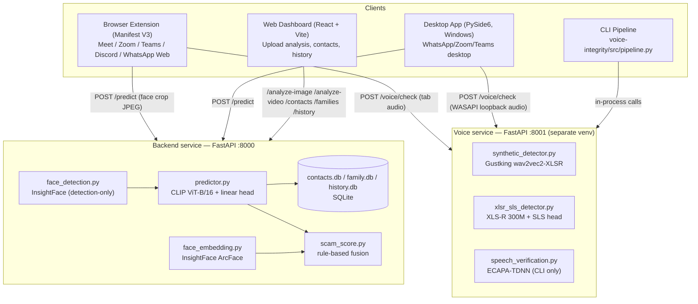

# Trinetra — Real-Time Deepfake & Voice-Clone Detection for Video Calls

**Project report — architecture, technical design, requirements, and datasets**
Generated from the current state of the codebase at `c:\Users\navne\Desktop\SIH\meet-deepfake-detector`.

---

## Table of Contents

1. [Project Overview](#1-project-overview)
2. [System Architecture](#2-system-architecture)
3. [Technical Design](#3-technical-design)
4. [Project Status Report](#4-project-status-report)
5. [Requirements](#5-requirements)
6. [Datasets](#6-datasets)

---

## 1. Project Overview

**Trinetra** watches faces and voices during a live video call and flags likely deepfakes/voice
clones in real time, while also cross-checking the caller's identity against a personal contact
list or family circle to catch impersonation/scam attempts. It ships as four cooperating clients
around one backend contract:

| Client | Purpose | Reaches calls on |
|---|---|---|
| **Browser extension** (Manifest V3) | Live in-page detection overlay | Google Meet, Zoom Web, Microsoft Teams, Discord, WhatsApp Web |
| **Desktop app** (PySide6, Windows) | Live detection for apps a browser can't see | WhatsApp Desktop, Zoom desktop app, Teams desktop app |
| **Web dashboard** (React) | Offline/forensic analysis, contact & history management | Any browser, `localhost` |
| **CLI pipeline** (`voice-integrity/src/pipeline.py`) | One-shot reference-vs-incoming voice check | Analyst/manual use |

All four talk to two local backend services — a face/identity service and a separate voice
anti-spoofing service — that run entirely on the user's own machine. No media is sent to any
third-party cloud API.

---

## 2. System Architecture

### 2.1 Component map



### 2.2 Why two separate backend processes

The face/backend stack (`torch`, `open_clip`, `insightface`, `onnxruntime`) and the voice stack
(`fairseq`, `speechbrain`, hand-patched `hydra-core`/`omegaconf`, Python-3.11 compatibility
monkeypatches) have real, unresolved dependency conflicts. Rather than fight that, they are two
independent FastAPI services in two independent virtualenvs:

- `backend/` → `uvicorn main:app` on **:8000**
- `voice-integrity/src/` → `uvicorn server:app` on **:8001**

Every client (extension, desktop, dashboard) is written to call both services independently and
combine the results client-side (the extension shows a per-tile face badge plus a separate
page-level voice banner; there is no server-side fusion of face + voice signals).

### 2.3 Real-time face pipeline (extension)

```mermaid
sequenceDiagram
    participant V as <video> tile
    participant CS as content.js (every 3s)
    participant OFF as offscreen.js (MediaPipe WASM)
    participant BG as background.js (service worker)
    participant BE as backend :8000

    CS->>CS: captureFrame(video) -> canvas
    CS->>BG: DETECT_FACES (frame as data URL)
    BG->>OFF: OFFSCREEN_DETECT_FACES
    OFF-->>BG: faces[] (normalized bbox, BlazeFace)
    BG-->>CS: faces[]
    CS->>CS: cropFaceFromCanvas() per face -> 256x256 JPEG
    par per detected face
        CS->>BE: POST /predict (face.jpg, platform, contact_id?)
        BE-->>CS: fake_probability, classification, identity_match, scam_likelihood
    end
    CS->>CS: overlay.js draws REAL/FAKE/UNCERTAIN badge per face
```

Audio runs on a parallel, independent loop: `content.js` fires a one-time `MEETING_STARTED`
signal on the first detected video tile → `background.js` starts `chrome.tabCapture` → the
captured tab-audio stream is analyzed inside the offscreen document → results are relayed back
as `VOICE_CHECK_RESULT` messages and rendered as a page-level voice banner, independent of the
per-tile face badges.

### 2.4 Desktop pipeline

Same shape, different capture source: `windows-capture` (Windows Graphics Capture API) grabs
frames from a user-picked window (`window_picker.py`, backed by `win32gui`) instead of reading a
DOM `<video>` element. `face_pipeline.py` runs MediaPipe locally (no offscreen-document
workaround needed — it's a normal Python process), `tracker.py` tracks faces across frames,
`api_client.py` posts crops to the same `/predict` endpoint, and `overlay.py` draws a transparent
always-on-top window over the captured app. `audio_worker.py` captures system-wide output audio
via WASAPI loopback (`pyaudiowpatch`) and posts it to `/voice/check` — this is system-wide audio,
not per-application, which is a deliberate, documented limitation.

### 2.5 Dashboard / offline analysis pipeline

The web dashboard does **not** reuse the real-time per-crop contract. It uploads a raw,
uncropped photo or video straight to the backend, which does its own face detection
server-side (`image_pipeline.py` / `video_pipeline.py`, InsightFace `buffalo_l`
detection-only), crops with a margin, quality-gates, batches every crop through
the same CLIP+head model in one forward pass, and aggregates:

- **Image**: worst-case-wins across all faces in the photo (one confidently-fake face is the finding).
- **Video**: samples ~1 frame/sec (clamped 5–40 frames), scores the largest face per frame,
  aggregates by **median** (outlier-resistant) and reports **suspicious segments** — runs of
  ≥2 consecutive sampled frames above the fake threshold, so a single motion-blur spike can't
  flag a clip.

### 2.6 Data flow contract (backend `/predict`)

```
POST /predict  (multipart/form-data: file, platform?, contact_id?, family_member_id?)
  → quality gate (sharpness + size)
  → CLIP ViT-B/16 encode → linear head → sigmoid → fake_probability
  → classify: fake (>=0.65) | real (<=0.35) | uncertain | insufficient_quality
  → optional identity check: ArcFace embedding vs. stored contact/family embedding (cosine similarity, threshold 0.45)
  → scam_score.compute_scam_score(fake_probability, identity_similarity)
  → logged to history.db (thumbnail + scores)
  → JSON response
```

---

## 3. Technical Design

### 3.1 Face deepfake classifier

| Aspect | Detail |
|---|---|
| Architecture | Frozen **OpenCLIP ViT-B/16** image encoder (`laion2b_s34b_b88k` checkpoint, 512-d embeddings) + a trained **linear classification head** (single `Linear(512, 1)` + sigmoid) |
| Checkpoint | `backend/models/demo_head.pt` — carried over from an external project, `trinetra_v1_export` |
| Input | 224×224 RGB (CLIPBackbone resizes/normalizes internally, reading mean/std from the checkpoint's own OpenCLIP transform) |
| Inference | Batched (`predict_fake_probabilities_batch`) — one forward pass for N crops instead of N passes; used for video-frame scoring |
| Threshold | Checkpoint's own raw threshold is **0.5** (uncalibrated sigmoid cutoff, not a real probability) |
| App-level decision bands | `FAKE_THRESHOLD=0.65`, `REAL_THRESHOLD=0.35` — anything between is reported `uncertain` rather than forced to a side |
| Device | CUDA if available, else CPU (`torch.cuda.is_available()`) |
| Superseded design | This replaced an earlier **DeepfakeBench UCF+SPSL+Xception ensemble**; that ensemble cut FaceShifter false negatives from 9/12 to 3/12 vs. UCF alone but is no longer what's wired into `main.py` (see git history) |

Known accuracy (from `backend/models/demo_train_report.json`, trained on 80 FaceForensics++ videos):

| Split | Videos | Crops | Crop acc | Video acc | Video AUC |
|---|---|---|---|---|---|
| Train | 80 | 7045 | 0.878 | **0.95** | **0.99** |
| Val | 24 | 2172 | 0.588 | **0.54** | **0.67** |
| Test | 24 | 2225 | 0.648 | **0.58** | **0.72** |

The gap between train and held-out performance is large and openly documented in the code
comments — see [§4 Project Status](#4-project-status-report).

### 3.2 Face detection

Two separate detectors are used depending on the caller, both built on **InsightFace `buffalo_l`**:

- **Real-time clients** (extension/desktop): **MediaPipe Tasks Vision — BlazeFace (short-range)**,
  running client-side (WASM in the extension's offscreen document; native in the desktop app).
  Only an already-cropped, already-256×256 JPEG face reaches the backend on this path — the
  backend does not re-detect for `/predict`.
- **Dashboard uploads**: server-side InsightFace `FaceAnalysis(allowed_modules=["detection"])`
  (`face_detection.py`) — detection-only (RetinaFace `det_10g`), CPU, deliberately not loading the
  landmark/recognition heads since dashboard analysis only needs bbox + detection score.

Crop convention: square, margin-padded (`FACE_CROP_MARGIN_RATIO = 0.3`) around the bbox, resized
to 256×256 — mirrored identically between `face_detection.py` (server) and
`extension/frame-capture.js` (client) so a dashboard-uploaded photo is treated the same way a
live call frame would be.

### 3.3 Identity verification (contacts & family circles)

- **Embeddings**: InsightFace `buffalo_l` **ArcFace** recognition model, 512-d, CPU-only
  (`face_embedding.py`).
- **Matching**: cosine similarity against a stored reference embedding; `IDENTITY_MATCH_THRESHOLD
  = 0.45`.
- **Contacts**: one reference photo → one embedding, stored in `contacts.db`.
- **Family Circles**: multiple enrollment photos averaged (L2-normalize each → mean → re-normalize)
  into one more robust reference embedding; membership goes through a `pending → approved/rejected`
  workflow gated by a **shared passcode** (`family_db.py`) — explicitly documented as a simple,
  non-production auth model suitable for a household/demo, not real per-user accounts.
- Storage: plain **SQLite** files (`contacts.db`, `family.db`, `history.db`), embeddings stored as
  JSON-encoded float arrays.

### 3.4 Face-crop quality gate

Two independent checks (`preprocessing.py`) run before any crop is scored, so the model never
emits a confident-looking number on unusable input:

1. **Pixel dimensions** ≥ `MIN_FACE_CROP_PX = 64` — only bites on unresized dashboard crops (the
   real-time path always sends a fixed 256×256, so this check is a no-op there).
2. **Sharpness** — variance of the Laplacian ≥ `MIN_SHARPNESS_VARIANCE = 15.0`. This is what
   actually catches an upsampled/blurry crop on the fixed-256×256 real-time path. Threshold was
   lowered from an original photo-only calibration after real compressed-video (H.264) frames
   from legitimate faces were measured landing at 26–40 — right on top of the "bad" synthetic
   range — and getting wrongly rejected.

### 3.5 Scam-likelihood score

A **transparent, rule-based fusion** (`scam_score.py`), not a trained model — deliberately, since
there is no labeled multimodal scam-call dataset to train a real fusion classifier on, and a
rule-based score is more explainable to an end user ("flagged because: face doesn't match contact
+ deepfake artifacts detected"):

```
weights = { face_fake_probability: 0.35, face_identity_mismatch: 0.25 }
score   = weighted average of whichever signals are present, renormalized to [0,1]
```

Voice signals were originally part of this fusion and were **removed** after the 3-model voice
ensemble was validated against known synthetic samples and consistently scored them only 2–7%
fake — a confidently-wrong signal was judged worse than no signal for a security score.

### 3.6 Video aggregation

`video_pipeline.py`: even-spaced sampling (target ≈ `VIDEO_SAMPLE_FPS=1.0`, clamped to
`[MIN_VIDEO_SAMPLE_FRAMES=5, MAX_VIDEO_SAMPLE_FRAMES=40]`), largest face per sampled frame, one
batched model call across all queued crops, then:

- **Overall score** = **median** of per-frame fake probabilities (outlier-resistant vs. mean).
- **Suspicious segments** = contiguous runs of ≥ `MIN_SUSPICIOUS_RUN_FRAMES=2` sampled frames at
  or above `FAKE_THRESHOLD`, reported with peak probability and frame count.

### 3.7 Voice anti-spoofing

Two independent, pretrained detectors, used in parallel — no shared architecture, deliberately,
to get two uncorrelated opinions:

| Model | Basis | Speed | Reported accuracy |
|---|---|---|---|
| **Gustking** (`synthetic_detector.py`) | `Gustking/wav2vec2-large-xlsr-deepfake-audio-classification` (HuggingFace `transformers`) | Fast | ~93% in-domain accuracy (model card) |
| **XLS-R + SLS** (`xlsr_sls_detector.py`) | XLS-R 300M (fairseq, frozen) + trained SLS classification head (`sls_head_v1.pth`, the "v1/epoch_2.pth" checkpoint — chosen over v2 for better cross-domain generalization) | Slower (real 300M-param transformer forward pass) | **2.14% EER** ASVspoof2021 DF · **3.51% EER** ASVspoof2021 LA · **7.84% EER** In-the-Wild — reproducing Zhang/Wen/Hu, *"Audio Deepfake Detection with XLS-R and SLS classifier,"* ACM Multimedia 2024 |

**Fusion rule** (`server.py`, the automatic extension/desktop path): flagged as `FAKE/SPOOFED` if
**both** models independently cross `SPOOF_THRESHOLD=0.5`, **or** either model alone crosses
`HIGH_CONFIDENCE_SPOOF=0.85`. The high-confidence override exists because XLS-R+SLS is prone to
false positives on real-world noisy/compressed audio outside its training domain (hence the
"both must agree" default), but was calibrated against a real known clone sample where XLS-R+SLS
scored 99.9% spoof while Gustking only reached 44% — the AND rule alone would have missed it.

A third check, **ECAPA-TDNN speaker verification** (`speech_verification.py`,
`speechbrain/spkrec-ecapa-voxceleb`), proves voice *identity* (cosine similarity between reference
and incoming clip), not authenticity — a convincing clone legitimately passes it. It is wired into
the CLI `pipeline.py` 3-check flow but **not** into the automatic extension/desktop `/voice/check`
path, which has no reference-voice enrollment flow yet.

### 3.8 Client technology stack

| Client | Stack |
|---|---|
| **Extension** | Manifest V3, vanilla JS content scripts, MediaPipe Tasks Vision (BlazeFace, WASM) in an offscreen document, `chrome.tabCapture` for audio |
| **Desktop** | Python, PySide6 (Qt) GUI, `windows-capture` (Windows Graphics Capture API), `pywin32` for window enumeration/rect tracking, MediaPipe for detection, `pyaudiowpatch` (WASAPI loopback) for system audio |
| **Dashboard** | React 19 + TypeScript, Vite 8, Tailwind CSS v4, `react-router-dom` v7, `jspdf`/`jspdf-autotable` for exportable PDF reports |

### 3.9 API surface (backend, `:8000`)

| Endpoint | Purpose |
|---|---|
| `POST /predict` | Score one pre-cropped face; optional identity match + scam score |
| `POST /analyze-image` | Detect + score every face in an uploaded photo |
| `POST /analyze-video` | Sample + score frames from an uploaded video |
| `POST /contacts`, `GET /contacts` | Enroll / list trusted contacts |
| `POST /families`, `/join`, `/members`, `/approve`, `/reject` | Family Circle workflow |
| `GET /history` | Recent predictions log |
| `GET /health` | Liveness check |
| `GET /model-info` | Which checkpoint/device is actually loaded |
| `GET /dashboard`, `/analyze-ui`, `/contacts-ui`, `/family-ui` | Built-in HTML UIs |

### 3.10 API surface (voice service, `:8001`)

| Endpoint | Purpose |
|---|---|
| `POST /voice/check` | Anti-spoofing verdict on an uploaded audio clip (auto-resampled to 16kHz mono) |
| `GET /health` | Liveness check |

---

## 4. Project Status Report

This codebase is unusually explicit about its own limitations — the following are drawn directly
from comments and docstrings in the code, not external assessment:

- **The demo face classifier is a small, overfit model.** Trained on only 80 videos; held-out
  video accuracy is 0.54–0.58 (barely above chance) versus 0.95 on training data. `predictor.py`
  states directly: *"treat `fake_probability` as a weak signal, not a verdict, until it's
  retrained on more data with a proper held-out sweep."*
- **Classification thresholds (0.65 / 0.35) are not a calibrated operating point.** They come
  from informal manual testing against ~120 labeled FaceForensics++ frames (including one unseen
  manipulation method, FaceShifter, as a generalization check) — not a full precision/recall
  sweep, and there is no held-out evaluation set in the project to build one.
- **Quality-gate thresholds (crop size, sharpness) are coarse, unswept floors** from manual
  testing, explicitly not derived from a labeled sharp/blurry dataset.
- **The scam-likelihood score is heuristic, not learned** — by design, since no labeled
  multimodal scam-call dataset exists to train a fusion model on.
- **Voice signals were dropped from the scam score** after the voice ensemble scored known fakes
  as only 2–7% fake in validation.
- **XLS-R+SLS voice anti-spoofing generalizes worst on real-world audio** (7.84% EER on
  In-the-Wild vs. 2–3.5% on in-domain ASVspoof splits), which is exactly the audio a live call
  produces — mitigated, not solved, by the dual-model AND/high-confidence-override fusion rule.
  This gap was empirically found via a real captured clone sample in `voice-integrity/data/`.
- **Family Circle auth is intentionally simple** (shared passcode, no per-user accounts) —
  documented as suitable for a demo/household use case, explicitly **not** production-grade
  access control.
- **The desktop app's system-audio capture is system-wide, not per-application** — a documented,
  accepted limitation of WASAPI loopback capture.
- **Real-time speaker-identity verification (ECAPA) is not wired into the automatic path** —
  it exists and works in the CLI pipeline, but the extension/desktop voice check is
  anti-spoofing-only, since no reference-voice enrollment flow has been built for it yet.

### Test coverage

`backend/tests/` contains a pytest suite (~783 lines across `test_api.py`, `test_config.py`,
`test_face_detection.py`, `test_image_pipeline.py`, `test_model_integration.py`,
`test_preprocessing.py`, `test_scam_score.py`, `test_video_pipeline.py`). No automated test suite
was found for `voice-integrity/`, `extension/`, `desktop/`, or `frontend/` at the time of this
report.

---

## 5. Requirements

### 5.1 Functional requirements

- Detect likely deepfake faces in real time during a call on Meet, Zoom Web, Teams Web, Discord,
  and WhatsApp Web (extension), and in native WhatsApp/Zoom/Teams desktop apps (desktop client).
- Classify each face into `real` / `fake` / `uncertain` / `insufficient_quality`, with a numeric
  `fake_probability` and a per-request `model_version`.
- Enroll a trusted contact from a reference photo and match a live call face against it
  (cosine similarity + pass/fail + score).
- Support Family Circles: multi-photo enrollment, head-of-family passcode-gated
  approve/reject workflow.
- Compute an explainable scam-likelihood score combining deepfake and identity-mismatch signals.
- Check call audio for voice cloning/spoofing independently of the face check, with a `verdict`
  (`FAKE/SPOOFED` / `LIKELY GENUINE`) and per-model probabilities.
- Offer offline dashboard analysis of an uploaded photo (every face scored) or video (sampled
  frames, aggregate verdict, suspicious-segment timeline).
- Maintain a queryable history of past predictions with thumbnails.
- Expose model/device introspection for operational visibility (`/model-info`).
- Export dashboard findings as a PDF report (`jspdf`/`jspdf-autotable`, frontend).

### 5.2 Non-functional requirements

- **Local-first / privacy-preserving**: all inference and storage stay on `127.0.0.1`; request
  logging captures metadata only, never raw media bytes.
- **Latency**: real-time clients must sustain a bounded per-cycle budget (extension: 3s poll
  interval, all tiles processed concurrently; desktop: 1s detection interval) — face crops are
  small (≈256×256) specifically to keep this bounded.
- **Resource bounds**: uploads capped at 8MB (images) / 200MB & 5 min (video) to bound worst-case
  server load from a single local request.
- **CORS restricted** to the exact set of supported call-platform origins plus localhost dev
  ports — not open to arbitrary origins.
- **Fail safe, not fail confident**: unscoreable crops are reported `insufficient_quality`
  (`fake_probability: null`) rather than forced through the model; unhandled server errors return
  a generic 500 with a request id, never an internal stack trace.
- **Traceability**: every request gets a UUID `request_id`, logged with path/status/latency and
  echoed in the response and an `X-Request-ID` header.

### 5.3 System / environment requirements

| Requirement | Detail |
|---|---|
| OS | Desktop client requires **Windows** (Windows Graphics Capture API, `pywin32`, WASAPI via `pyaudiowpatch`). Backend, voice service, extension, and frontend are OS-agnostic. |
| Python | Two **separate virtual environments** are required — `backend/venv` and `voice-integrity/venv` — due to real dependency conflicts between the `torch`/`insightface` stack and the `fairseq`/`speechbrain` stack. A third venv (or the desktop's own) is needed for `desktop/`. |
| GPU | Optional but recommended. CUDA-capable GPU accelerates both the CLIP+head face classifier and the XLS-R 300M voice model; both cleanly fall back to CPU (`torch.cuda.is_available()`). |
| Node.js | Required to build/run the dashboard (Vite 8, npm). |
| Browser | Chrome (or a Chromium browser supporting Manifest V3, `offscreen`, `tabCapture`) for the extension. |
| Network | Backend (`:8000`) and voice service (`:8001`) must be reachable at `127.0.0.1` from all clients — no external network access needed at runtime beyond first-run model downloads. |
| First-run downloads | CLIP ViT-B/16 (~600MB, via `open_clip`/HuggingFace), InsightFace `buffalo_l` (~350MB, to `~/.insightface/`), Gustking wav2vec2 checkpoint (HuggingFace), XLS-R 300M backbone + SLS head (fairseq/HuggingFace), ECAPA-TDNN (~20MB, speechbrain). All cached locally after first use. |

### 5.4 Key dependencies by component

| Component | Core dependencies |
|---|---|
| `backend/` | `fastapi`, `uvicorn`, `torch`, `torchvision`, `open_clip_torch`, `insightface`, `onnxruntime`, `opencv-python`, `pillow`, `numpy` |
| `voice-integrity/` | `fastapi`, `uvicorn`, `torch`, `torchaudio`, `transformers`, `huggingface_hub`, `fairseq==0.12.2`, `hydra-core`, `omegaconf`, `speechbrain`, `soundfile`, `scipy` |
| `desktop/` | `windows-capture`, `mediapipe`, `PySide6`, `pywin32`, `pyaudiowpatch`, `opencv-python`, `numpy`, `requests` |
| `extension/` | MediaPipe Tasks Vision (bundled WASM), no external build dependencies (vanilla JS, Manifest V3 APIs) |
| `frontend/` | `react` 19, `react-dom`, `react-router-dom` 7, `jspdf`, `jspdf-autotable`, `tailwindcss` 4, `vite` 8, `typescript` |

---

## 6. Datasets

| Dataset | Used for | Role in this project |
|---|---|---|
| **FaceForensics++** (subset: `Deepfakes`, `Face2Face`, `FaceSwap`, `NeuralTextures` + `original`) | Training and held-out evaluation of the face deepfake classifier's linear head | 80 videos / 7045 crops train, 24 videos val, 24 videos test (see `demo_train_report.json`). A separate ~120-frame labeled sample (including the unseen **FaceShifter** method) was used to manually re-check classification thresholds each time the model was swapped. Raw video files are **not** included in this repo — only the trained checkpoint (`demo_head.pt`) and its JSON eval report are. |
| **LAION-2B** | Pretraining corpus behind the frozen CLIP ViT-B/16 backbone (`laion2b_s34b_b88k`, via OpenCLIP) | Used strictly as a frozen, off-the-shelf feature extractor — not trained or fine-tuned in this project. |
| **ASVspoof 2021 DF** | Reported benchmark for the XLS-R+SLS voice anti-spoofing head | 2.14% EER (from the upstream model's published results, not re-evaluated locally). |
| **ASVspoof 2021 LA** | Reported benchmark for the XLS-R+SLS voice anti-spoofing head | 3.51% EER (upstream published result). |
| **In-the-Wild** | Reported benchmark for the XLS-R+SLS voice anti-spoofing head, closest proxy to real deployment conditions | 7.84% EER (upstream published result) — the weakest of the three, which motivated the dual-model fusion rule in `server.py`. |
| **VoxCeleb** | Training corpus behind the ECAPA-TDNN speaker verification model (`speechbrain/spkrec-ecapa-voxceleb`) | Used pretrained/frozen for voice identity verification (CLI pipeline only). |
| **Gustking's training data** (unspecified in this repo) | Training corpus behind `Gustking/wav2vec2-large-xlsr-deepfake-audio-classification` | Used pretrained/frozen; ~93% in-domain accuracy is the upstream model card's own claim, not independently re-verified here. |
| **InsightFace `buffalo_l` model-pack training data** (large-scale face recognition corpora, e.g. MS1M/Glint360K-style, per the standard InsightFace model zoo) | Training corpus behind face **detection** (RetinaFace `det_10g`) and face **recognition** (ArcFace) | Used pretrained/frozen for both face detection and identity embeddings; not trained in this project. |
| **Local ad hoc voice samples** (`voice-integrity/data/reference/`, `voice-integrity/data/incoming/`) | Manual pipeline testing/calibration, e.g. `ref.wav` / `reference.wav` vs. multiple `cloned*.wav` variants (raw, denoised, resampled, different clone-generation step counts) | Not a formal labeled dataset — used to hand-verify the pipeline (e.g. the specific clone sample where XLS-R+SLS scored 99.9% spoof while Gustking scored only 44% fake, which motivated `HIGH_CONFIDENCE_SPOOF`). |

**Note on provenance**: `demo_train_report.json` records its source manifest as an external path
(`F:\Deepfake-Video-Detection-Project\data\splits\demo_manifest.json`) from the machine the model
was originally trained on — that manifest and the underlying FaceForensics++ video files are not
part of this repository; only the resulting checkpoint and evaluation numbers are.

---

*This report reflects the code as read directly from the repository — model architectures,
thresholds, and dataset references are taken from source comments, docstrings, and config values,
not from external documentation.*
